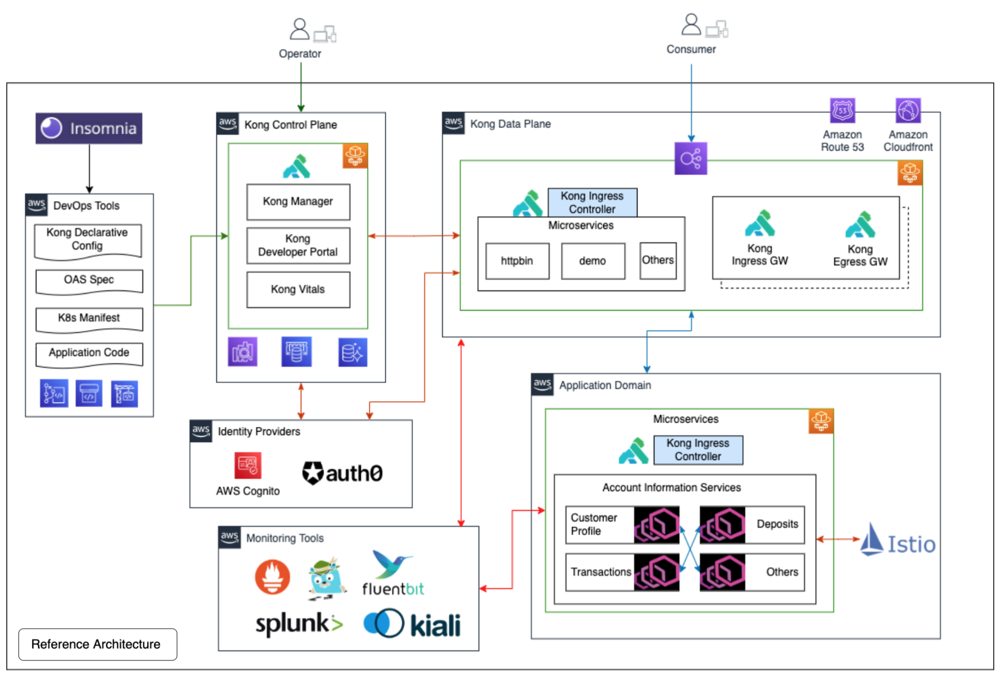

# Kong Hybrid and Istio Recipe

This is a repository for the Kong Hybrid and Istio Integration artifacts and steps.

The artifacts here are meant for reference, and will need further refinement for production usage

## Infrastructure preparation

For reference, we can created two AWS EKS Clusters, one functioning as a Control Plane , and another as a Data Plane. The sizings and vm type for the Kubernetes nodes are based on PoC scenarios, please modify it based on your use case. Please refer to the sizing guide [here](https://docs.konghq.com/gateway/latest/plan-and-deploy/sizing-guidelines/) for better estimation.

```
# AWS Examples
# Creating Kong CP Cluster
eksctl create cluster --name Kong-{customer}-CP --version 1.24 --region ap-southeast-1 --without-nodegroup

eksctl create nodegroup --cluster Kong-{customer}-CP --name Worker-NG  --region ap-southeast-1 --node-type m5.xlarge --nodes 1 --max-pods-per-node 50

# Creating Kong DP Cluster
eksctl create cluster --name Kong-{customer}-DP --version 1.24 --region ap-southeast-1 --without-nodegroup

eksctl create nodegroup --cluster Kong-{customer}-DP --name Worker-NG  --region ap-southeast-1 --node-type m5.xlarge --nodes 2 --max-pods-per-node 50

# Creating Kong KIC and Istio Cluster
eksctl create cluster --name Kong-{customer}-KIC-Istio --version 1.24 --region ap-southeast-1 --without-nodegroup

eksctl create nodegroup --cluster Kong-{customer}-KIC-Istio  --name Worker-NG  --region ap-southeast-1 --node-type m5.large --nodes 2 --max-pods-per-node 50
```

Instead of cURL, we are using https://httpie.io/docs/cli for the steps below.

Based on your needs, you can run them with other IaC stack like Terraform or Pulumi. Optionally, you can also register a domain (hosted zone) in AWS Route 53 (Recommended)

## Sample Context Diagram



The above reference diagram depicts how Kong API Gateway can work alongside a service mesh (Istio). In this set-up we will be deploying 3 EKS Clusters , with each of them holding a specific responsibility. The motivation is to create a reference deployment model for customer’s consideration, and then evolve into a model that fits them best.

## Deploy Kong Gateways in Hybrid Mode

Refer to kong-gw folder and look at both helm values for CP and DP.

To allow both Kong CP and DP to communicate, we need to first generate a pair of TLS cert and key.  

```
openssl req -new -x509 -nodes -newkey ec:<(openssl ecparam -name secp384r1) \
  -keyout ./cluster.key -out ./cluster.crt \
  -days 1095 -subj "/CN=kong_clustering"
```


### Kong Control Plane

Switch to the Control Plane Kubernetes context , and create a secret based on the TLS cert/key generated previously

```
kubectl create ns kong
kubectl create secret tls kong-cluster-cert --cert=./cluster.crt --key=./cluster.key -n kong
```

Next, we need to create the license secret and default passwords

```
# kong-gw-cp-initial
kubectl create secret generic kong-enterprise-license -n kong --from-file=license=./license.json

# Super Admin Password that you can use to login to Kong Manager
kubectl create secret generic kong-enterprise-superuser-password \
-n kong \
--from-literal=password=xxxx # CHANGEME

#Creating session conf for Kong Manager and Kong DevPortal
kubectl create secret generic kong-session-config -n kong --from-file=admin_gui_session_conf --from-file=portal_session_con
```


Install the CP via Helm. Worthwhile to take a look at the values and understand its purpose,so you can tailor them to your scenario.

```
# Install Kong CP
helm install kong -f kong-gw/controlplane-values.yaml kong/kong --namespace kong
```

### Kong Data Plane

Switch to the Data Plane kubernetes context , and create a secret based on the TLS cert/key generated previously

```
kubectl create ns kong
kubectl create secret tls kong-cluster-cert --cert=./cluster.crt --key=./cluster.key -n kong
```

Next, we need to create the license secret too
```
kubectl create secret generic kong-enterprise-license -n kong --from-file=license=./license.json
```

Now, let's install the DP via Helm

Ensure the following fields are updated in dataplane-values.yaml. They are reference to your Control Plane endpoints. It should be an endpoint that can be **resolved** by your DataPlane (recommend to use private DNS, do look at controlplane-values.yaml for more information).

cluster_control_plane: #controlplane-url:8005
cluster_telemetry_endpoint: #controlplane-telemetry-url:8006 

```
# Install Kong DP
helm install kong -f kong-gw/dataplane-values.yaml kong/kong --namespace kong
```

### Deployment Verification

Check DP status from the CP. If everything works, you should get a 200 response and a list of the DP(s).

```
http <<kong-admin-api-url>:8001/clustering/status
```

Checking the Proxy that use the Load Balancer created during the deployment

```
export PROXY_URL=kubectl get service kong-kong-proxy -n kong --output=jsonpath='{.status.loadBalancer.ingress[0].hostname}'
xxxxxxxxxx.ap-southeast-1.elb.amazonaws.com (you can create an alias of NLB to Route 53)

# Test hitting the Proxy
http $PROXY_URL
HTTP/1.1 404 Not Found
Connection: keep-alive
Content-Length: 48
Content-Type: application/json; charset=utf-8
Date: Tue, 10 SGg 2021 21:31:39 GMT
Server: kong/2.5.0.0-enterprise-edition
X-Kong-Response-Latency: 0

{
    "message": "no Route matched with those values"
}

```

If all things work above, you should be good and ready to start creating a service and route.

```
http <<kong-admin-api-url>:8001/services name=httpbinservice url='http://httpbin.org'

http <<kong-admin-api-url>:8001/services/httpbinservice/routes name='httpbinroute' paths:='["/httpbin"]'

# Test the route and see if you get any response.
http $PROXY_URL/httpbin/get
```

##  Kong Kubernetes Ingress Controller with Istio

We use Kong KIC as an edge gateway, and this will be sitting in Istio service mesh

### Install Istio

```
❯ istioctl install --set profile=minimal \
  --set meshConfig.accessLogFile=/dev/stdout \
  --skip-confirmation
```

### Install and Annotate Kong Ingress Controller

```
# Create Namespace Kong
kubectl create namespace kong

# Label namespace to allow istio sidecar injection
kubectl label namespace kong istio-injection=enabled

# Install Kong with helm
helm upgrade -i my-kong kong/kong -n kong \
  --set image.tag=3.0 \
  --set ingressController.installCRDs=false --wait
```

### Deploy Observability Toolings (Optional)

To demostrate other observability toolings that might be required when working on your POV scenario, you can install them as part of istio addons

```
kubectl apply -f https://raw.githubusercontent.com/istio/istio/master/samples/addons/prometheus.yaml
kubectl apply -f https://raw.githubusercontent.com/istio/istio/master/samples/addons/kiali.yaml
kubectl apply -f https://raw.githubusercontent.com/istio/istio/master/samples/addons/jaeger.yaml
kubectl apply -f https://raw.githubusercontent.com/istio/istio/master/samples/addons/grafana.yaml
```

### Deploy Demo App

Next we can deploy a Demo Application

```
# Create namespace bookinfo
kubectl create namespace bookinfo
# Add lable to namespace for auto sidecar injection.
kubectl label namespace bookinfo istio-injection=enabled
# Install bookinfo app
kubectl apply -f https://raw.githubusercontent.com/istio/istio/master/samples/bookinfo/platform/kube/bookinfo.yaml -n bookinfo
```

### Deploy Sample Plugin

We can deploy a sample rate limit plugin based on Kong KIC crd to limite the number of calls to service hosted in the mesh

```
# Create a Kong Plugin 
kubectl apply -f - <<EOF
apiVersion: configuration.konghq.com/v1
kind: KongPlugin
metadata:
  name: rate-limiting
  namespace: echo
config:
  minute: 5
  policy: local
plugin: rate-limiting
disabled: false 
EOF
```

```
# Attached Plugin to an existing ingress
# Refer to echo-kic.yaml or echo-hybrid.yaml
apiVersion: networking.k8s.io/v1
kind: Ingress
metadata:
  name: echo
  annotations:
    konghq.com/plugins: rate-limiting
    cert-manager.io/cluster-issuer: letsencrypt-prod
  namespace: echo
spec:
  ingressClassName: kong
  rules:
  - host: echo-istio.aws.kongtest.net
    http:
      paths:
      - path: /
        pathType: ImplementationSpecific
        backend:
          service:
            name: echo
            port:
              number: 80
  tls:
  - hosts:
    - echo-istio.aws.kongtest.net
    secretName: echo-kong-istio
```

## Fluentbit Installation

We will install fluentbit in the KIC-Istio clsuter to demonstrate how easily Kong can support log forwarding and parsing

```
helm install fluentbit -f fluentbit/values.yam --namespace fluent fluent/fluent-bit  --create-namespace
```

After the fluentbit service are up, send a test request to check if the http (port 8888) have started to listen for incoming request.

```
kubectl run curler --image=curlimages/curl --rm -it --restart=Never -n fluent -- curl -XPOST -d '{"login":"bob","test":"123"}' -H "Content-Type: application/json"  http://fluentbit-fluent-bit.fluent.svc.cluster.local:8888/kong.log
```

Verify the log have been publish via stdout

```
kubectl logs -f pod/fluentbit-fluent-bit-xxxx  -n fluent
```

## Integration cert-manager for Kong (Optional)

Cert manager allows you to manage certs seamlessly within a cluster. With this integration, you can provision TLS certificate for Kong Services (Proxy,Manager etc) and certs for mTLS between Kong Control Plane and Kong Data Plane

### AWS IAM Set-up
Create a IAM Policy so as to allow cert-manager to interact with the DNS Domain

```
aws iam create-policy --policy-name Route53CertManagerPolicy --policy-document file://policy.json

#policy.json
{
   "Version": "2012-10-17",
   "Statement": [
       {
           "Effect": "Allow",
           "Action": "route53:GetChange",
           "Resource": "arn:aws:route53:::change/*"
       },
       {
           "Effect": "Allow",
           "Action": [
               "route53:ChangeResourceRecordSets",
               "route53:ListResourceRecordSets"
           ],
           "Resource": "arn:aws:route53:::hostedzone/{HostedZoneID}"
       }
   ]
}
``` 

Next we need to create an IAM role that our EKS cluster (cert-manager) will assume when making the update to Route 53.   This is made possible by establishing a trust between EKS (NodeGroup Role) and this new role we will be creating.

```
aws iam create-role --role-name dns-manager --assume-role-policy-document file://trust.json

#trust.json
   "Statement": [
     {
       "Effect": "Allow",
       "Principal": {
           "AWS": [
            "arn:aws:iam::{{account}}:role/{{EKS-NodegroupRole}}",
            "arn:aws:iam::{{account}}:role/{{EKS-NodegroupRole}}"
           ]
       },
       "Action": "sts:AssumeRole"
     }
   ]
 }
```
	
Lastly , attach the IAM policy we create to this IAM Role

```
aws iam attach-role-policy --policy-arn arn:aws:iam::{{account}}:policy/Route53CertManagerPolicy --role-name r53-manager
```

### Install cert-manager

In each of the Kubernetes Cluster, run the following command to install cert-manager

```
helm install \
  cert-manager jetstack/cert-manager \
  --namespace cert-manager \
  --create-namespace \
  --version v1.10.1 \
  --set installCRDs=true
```

For PoC purpose we will use LetsEncrypt as the public CA , and use DNS-resolve when issuing certificate
```
# Apply Cluster Issuer
kubectl apply -f cert-manager/cluster-issuer
```

## Reference

1) Deploying Kong in Hybrid Mode - https://docs.konghq.com/gateway/latest/production/deployment-topologies/hybrid-mode/setup/

2) Kong Helm Values - https://github.com/Kong/charts/blob/main/charts/kong/values.yaml

3) Kong Configuration Reference - https://docs.konghq.com/gateway/latest/reference/configuration/
